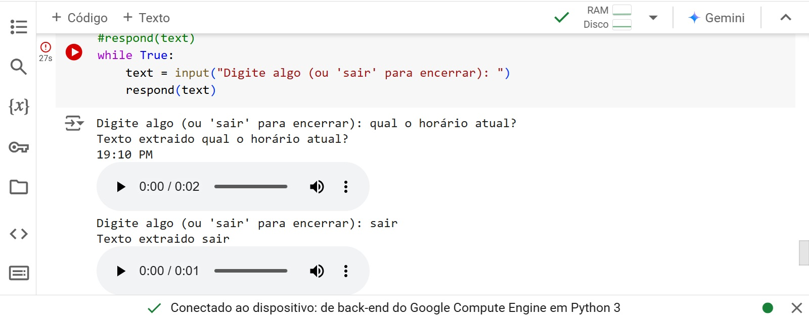

# Criando um sistema de assistência virtual do zero

No desafio do oitavo módulo do Bootcamp BairesDev - Machine Learning Practitioner promovido pela DIO chamado "Criando um sistema de assistência virtual do zero" foi desenvolvido um sistema de assistência virtual, utilizando PLN (Processamento de Linguagem Natural), com base nas bibliotecas apresentadas durante o curso. O código foi feito em Python no ambiente COLAB.

Bibliotecas utilizadas:

- Gtts
- Speech_recognition
- Playsound

